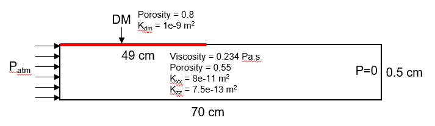
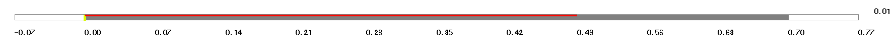

# LIMS Resin Flow Simulation with Distribution Media

This repository demonstrates a resin-flow simulation through porous composite reinforcement using **LIMS** and **LBasic**.

The model considers a 2D fabric domain with a one-dimensional distribution medium (DM) placed along part of the upper surface. Resin is injected from the left boundary, and the evolution of the top and bottom flow fronts is tracked during filling.

## Problem Description

<p align="center">
  
</p>

<p align="center">
  <em>Figure 1. Schematic of the resin-flow model with partial distribution media.</em>
</p>

The modeled fabric domain has the following dimensions and processing conditions:

- Length: 700 mm
- Thickness: 5 mm
- Distribution media length: 490 mm
- Mesh size: 0.5 mm × 0.5 mm
- Injection pressure: 100 kPa
- Outlet pressure: 0 Pa
- Resin viscosity: 0.234 Pa·s

### Fabric Properties

- Porosity: 0.55
- In-plane permeability, Kxx: 8 × 10^-11 m²
- Through-thickness permeability, Kzz: 7.5 × 10^-13 m²

### Distribution Media Properties

- Porosity: 0.80
- Permeability: 1 × 10^-9 m²
- Thickness: 1 mm

## Objective

The objective is to simulate resin transport through a porous fabric when a high-permeability distribution medium is present along part of the upper surface.

The distribution medium provides a preferential flow path and therefore causes the upper flow front to advance faster than the lower flow front.

The simulation tracks the flow-front position along the upper and lower boundaries as a function of filling time.

## 1. Geometry and Mesh Generation

The model geometry and finite-element mesh are generated using **LIMS LEGO**.

The fabric domain is 700 mm long and 5 mm thick. A uniform element size of 0.5 mm is used in both directions.

This gives:

- 1400 elements along the flow direction
- 10 elements through the fabric thickness
- 11 nodes through the fabric thickness

The distribution medium extends 490 mm from the inlet along the upper surface.

The DM is represented using one-dimensional elements that share nodes with the upper boundary of the two-dimensional fabric mesh.

### LEGO Definition File

The complete geometry, mesh, material properties, and distribution-media definition are provided in the LEGO `.def` file:

```text
geometry/part_dm_49cm.def
```

The `.def` file is the starting point for generating the LIMS model.

## 2. Generate the LIMS Model from the LEGO File

Before running the filling simulation, the LEGO `.def` file must be converted into a LIMS `.dmp` model.

Open a command prompt in the directory containing the LEGO definition file and run:

```cmd
lego part_dm_49cm.def part_dm_49cm.dmp
```

The general syntax is:

```cmd
lego input.def output.dmp
```

where:

- `input.def` is the LEGO geometry and mesh definition.
- `output.dmp` is the LIMS model generated from the LEGO definition.

For this example:

```text
part_dm_49cm.def
        ↓
      LEGO
        ↓
part_dm_49cm.dmp
```

The generated `.dmp` file is subsequently read by the LBasic simulation script.

<p align="center">
  
</p>

<p align="center">
  <em>Figure 2. Domain.</em>
</p>

## 3. LBasic Simulation

The transient filling simulation is controlled using an **LBasic** script.

The complete script is provided in:

```text
scripts/part_dm_49cm.lb
```

The LBasic script performs the following operations:

1. Reads the generated `.dmp` model.
2. Applies the resin injection pressure to the inlet nodes.
3. Advances the transient resin-filling solution using `SOLVE`.
4. Tracks the resin flow front along the top and bottom boundaries.
5. Writes the flow-front position as a function of simulation time.
6. Saves the final simulation results as `.dmp` and `.msh` files.

### Inlet Boundary Condition

A pressure of 100 kPa is applied to all 11 nodes along the left boundary:

```text
SETGATE 1, 1, 1.000000e+005
SETGATE 2, 1, 1.000000e+005
...
SETGATE 11, 1, 1.000000e+005
```

The right boundary is maintained at zero pressure.

## 4. Flow-Front Tracking

The LBasic script automatically tracks the flow-front position along the top and bottom surfaces.

Because the fabric contains 10 elements through the thickness, each vertical mesh column contains 11 nodes.

The bottom boundary nodes therefore follow:
1, 12, 23, 34, ...
and the top boundary nodes follow:
11, 22, 33, 44, ...
For horizontal mesh index `i`:
BottomNode = 1 + 11*i
TopNode    = 11 + 11*i

The horizontal position is:
x =i*DX

where:

DX = 0.0005 m

A node is considered to have been reached by the resin when:


SOFILLFACTOR > 0.99

The flow-front locations are evaluated at approximately 1 s intervals.

The script writes the results to:


flow_front_part_dm_49cm.txt


with the format:


Time(s) TopFront(m) BottomFront(m)


This provides the flow-front position versus filling time for both the upper and lower surfaces.

## 5. Running the Simulation

The simulation can be executed either through the **LIMS GUI** or from the **Windows command line**.

### Option A: LIMS GUI

1. Generate the `.dmp` model from the LEGO `.def` file.
2. Open LIMS.
3. Open the LBasic interface.
4. Paste or load the contents of the `.lb` script.
5. Make sure the working directory in the script points to the directory containing the generated `.dmp` file.
6. Run the LBasic script.
7. The simulation will continue until the filling condition specified in the LBasic script is reached.

The model is loaded inside the script using:

READ "part_dm_49cm.dmp"


### Option B: Windows Command Line

The LBasic script can also be executed directly from the Windows command prompt.

For the current LIMS installation, an example command is:

cmd
"LIMs directory" -x -lpart_dm_49cm


This command is executed from the working directory containing the simulation files.


## 6. Simulation Output

After completion, the LBasic script can save the final solution in LIMS dump and Gmsh formats.


## 7. Post-Processing

The generated flow-front text file can be imported into:

- Microsoft Excel
- MATLAB
- Python
- Other plotting or data-analysis software

The primary quantities of interest are:

- Top flow-front position versus time
- Bottom flow-front position versus time

The top and bottom flow fronts can be plotted together to visualize the effect of the high-permeability distribution medium.

<p align="center">
  
</p>

<p align="center">
  <em>Figure 3. Top & bottom flowfront vs time.</em>
</p>

## Notes

- LIMS must be installed separately to run the model.
- The LIMS installation itself is not included in this repository.
- Local paths in the LBasic or command-line examples should be modified according to the user's LIMS installation and working directory.
- The `.def` and `.lb` files provide the primary inputs required to reproduce the simulation.
